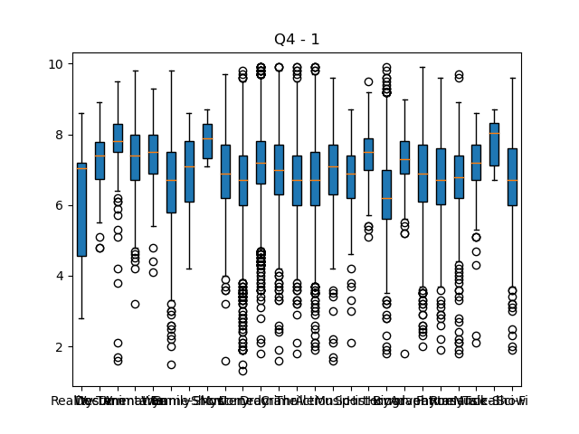
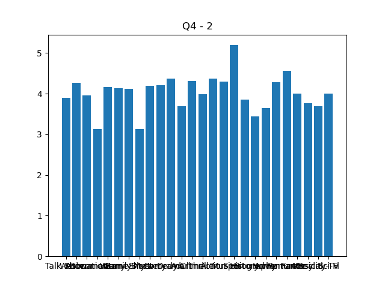
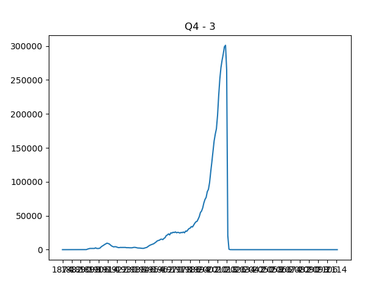

# bd-assignment-6
Data cleaning assingnment of Big Data.

## Required applications:
For Q2 and Q3:
* MongoDB v4.x.x
* npm v6.x.x
* NodeJS v12.x.x

For Q4:
* pip v20.x.x
* Python v3.x.x

## Test if connection to MongoDB is successful - Will work only if MongoDB is running locally on port 27017
* Open a terminal in the root of the repo.
* Execute the following:
```bash
npm test
```

## Q1: Details about file. 
The file extra-data.json is a multiline JSON file with a JSON object in each line.
These JSON objects have the following properties: 
* Some of the objects are empty `{}`.
* Other objects have atleast one of the following fields:
    * `IMDb_ID` -> Details about `_id` field in `movies` collection.
        * `type` -> Datatype of the value field. `"literal"` for every `IMDb_ID`.
        * `value` -> Value of the `_id` in the form `"tt<_id>"`. Integer part needs to be extracted and parsed to integer.
    * `titleLabel` -> Details about the `title` field in `movies` collection.
        * `type` -> Datatype of the value field. `"literal"` for every `titleLabel`.
        * `value` -> Value of the `title`.
    * `distributorLabel` -> Movie distributor details.
        * `xml:lang` -> 
        * `type` -> Datatype of the value field. `"literal"` for every `distributorLabel`.
        * `value` -> Name of the distributor.
    * `cost` -> Movie budget details.
        * `datatype` -> Datatype of the value to be used when storing it.
        * `type` -> Datatype of the value field. `"literal"` for every `cost`.
        * `value` -> Cost of production of the movie.
    * `box_office_currencyLabel` -> Currency details.
        * `xml:lang` -> 
        * `type` -> Datatype of the value field. `"literal"` for every `box_office_currencyLabel`.
        * `value` -> Full form of currency.
    * `box_office` -> Movie revenue details.
        * `datatype` -> Datatype of the value to be used when storing it.
        * `type` -> Datatype of the value field. `"literal"` for every `box_office`.
        * `value` -> Box office collection of the movie.

Also a few important points:
* It is possible that there are multiple rows for a particular `IMDb_ID.value`.
* It is possible that the `title` in `movies` collection is different that the ones in file for a particular `IMDb_ID.value`.
* It is also possible that there is no `IMDb_ID.value` for few rows. In that case we have to match using `titleLabel.value`.

Before running Q2 and Q3, please run the following:
```bash
npm install
```

## Q2: Update movies with extra-data using _id
Make sure you have the extracted data in ```./data/extra-data.json```
Also, to make sure there is distinction in data updated in q2 and q3, I have used collection `movies2` to update in q2. Therefore, you need to have `movies` data in `movies2` collection.
* Open a terminal in the root of the repo.
* Execute the following:
```bash
npm run-script q2
```

## Q3: Update movies with extra-data using title
Make sure you have the extracted data in ```./data/extra-data.json```
Also, to make sure there is distinction in data updated in q2 and q3, I have used collection `movies3` to update in q3. Therefore, you need to have `movies` data in `movies3` collection.
* Open a terminal in the root of the repo.
* Execute the following:
```bash
npm run-script q3
```

## Q4: Data visualizations
First of all, run the following
```bash
pip install pymongo matplotlib numpy
```
Question 4.1 - Run the following in root of repo to get the below graph.
```bash
python3 ./q4/q4_1.py
```


Question 4.2 - Run the following in root of repo to get the below graph.
```bash
python3 ./q4/q4_2.py
```


Question 4.3 - Run the following in root of repo to get the below graph.
```bash
python3 ./q4/q4_3.py
```
